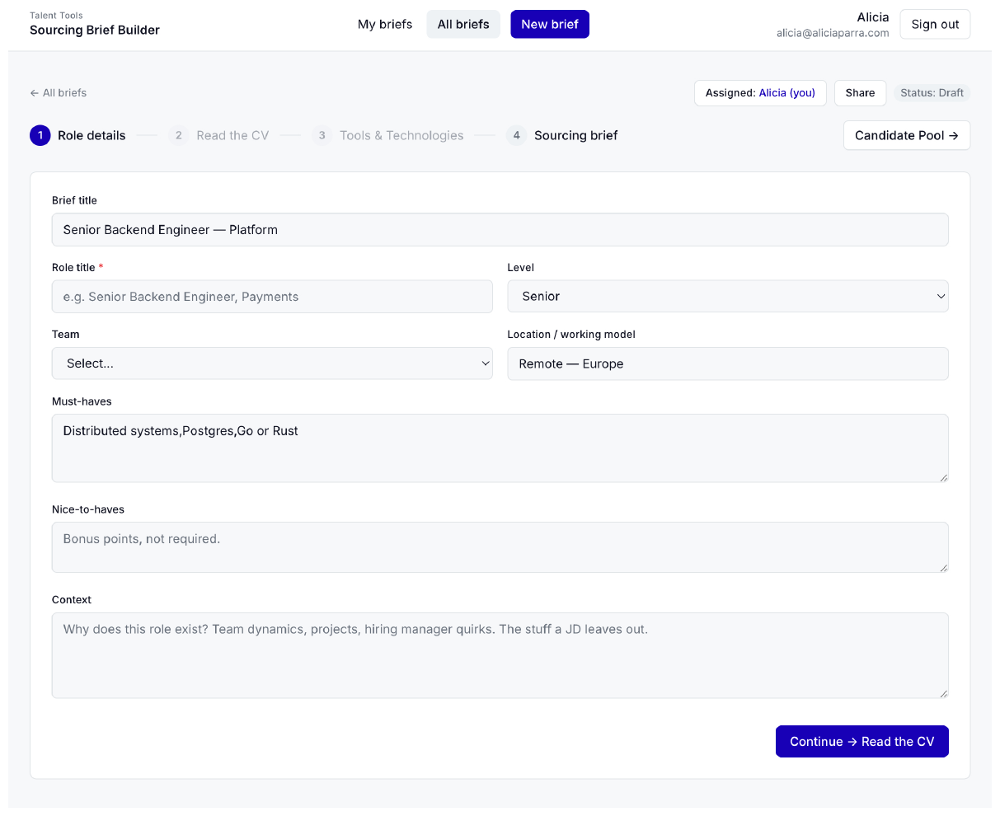

# Sourcing Brief Builder 🔎

An internal Talent tool that turns a job description into a guided sourcing strategy — where to look, what to search, and who to reach out to — for hard-to-fill technical roles.

## 🔗 Live demo

**[sourcing-muse.vercel.app](https://sourcing-muse.vercel.app)**

Want to try it out? Email me and I'll send over demo access.

All briefs and candidates in the demo are entirely fictional — invented roles, invented names, invented profile links — generated purely to showcase how the tool works.

## Screenshot

## The problem it solves

Hiring for technical and specialist roles has gotten highly specific, and LinkedIn alone doesn't cut it anymore — the strongest engineers, researchers, and builders often don't have optimised LinkedIn profiles. Their real signal lives on GitHub, in research papers, on conference speaker lists, in blog posts.

The gap isn't just *where to look* — it's that junior and less experienced recruiters don't carry the tacit judgment senior sourcers build up over years: which signals actually matter for a given role, what "good" looks like on each channel, and how to read a CV the way an experienced recruiter does. This tool externalises that judgment into a repeatable, guided system.

## Who it's for

Recruiters sourcing technical roles (engineering, platform, data, security, ML/research, and adjacent disciplines). Built to scaffold instincts for less experienced recruiters, not just save time for experienced ones.

## Core principles

- **Role-specific, never generic.** Every suggestion — CV-reading specifics, tech stack, channels, search strings — traces back to something explicit or clearly implied in the actual job description.
- **No fabrication.** The tool never invents facts about a candidate, a company, a repository, or a paper. Where live data can be verified (GitHub, arXiv, Dev.to), it's fetched for real. Where it can't, the tool gives a search link and honest guidance instead of guessing.
- **Absence isn't a red flag.** A candidate with no public GitHub or blog isn't penalised — many strong candidates come by referral, not visibility.
- **Short tenure isn't a red flag either.** Active career navigation is treated as a positive signal, distinct from stagnation.
- **This is a sourcing tool, not an ATS.** Built for a curated shortlist of roughly 10–20 people per role, not a full applicant pipeline.

## How it works

### 1. Role details
Paste a job description (text, file upload, or URL), plus notes from the hiring-manager intake conversation. The tool extracts and pre-fills role title, level, team, location, must-haves, nice-to-haves, and context.

### 2. Read the CV
A fixed framework of **9 dimensions** that mirror how an experienced recruiter reads a candidate profile — experience & maturity, foundational company exposure, depth of impact, career agency, industry background, global/open-mindedness signal, education, public footprint, and research contribution. Only the dimensions switched "on" for a given role shape the sourcing brief.

### 3. Tools & technologies
A concrete skill checklist — specific languages, frameworks, and platforms — with proficiency level and weight per item, grounded in the actual role.

### 4. Sourcing brief
The output: a summary, target companies, keywords, two Boolean search variants, an outreach angle, red flags, and ranked channel cards (GitHub, LinkedIn, X/Twitter, Dev.to, Medium, arXiv, Google X-ray search, and others) — each with a why, a how-to-search guide, and, where a real API exists, live verified results. A search log lets recruiters mark companies and channels "done," attributed and timestamped.

### 5. Candidate pool
Promising people are added manually with their name, links, and the recruiter's fit notes. The tool drafts a personalised outreach message grounded only in what's actually been entered.

## Collaboration

Briefs and candidate pools are shared across the team, with every action attributed to who did it and when — so a role can be handed off between recruiters without losing progress.

## Scope note

This tool intentionally does **not** automatically scrape or aggregate public data on named individuals at scale. Sourcing suggestions are strategy — where and how to look. Candidate records are only created manually, one at a time, by a recruiter who has already found and intends to contact that specific person.

## Tech stack

Built with Lovable (TanStack Start frontend + edge functions) and Supabase (auth, database, storage), with live lookups to GitHub, arXiv, and Dev.to's public APIs. Deployed on Vercel.

## Status

This is a showcase / portfolio project demonstrating the workflow and build — not currently in active production use. This repository and its live demo run on a fully separate, personal Supabase project seeded with fictional data. No real candidate or personal data is included anywhere in this repository or its deployment.

## Running it locally

\`\`\`
npm install
npm run dev
\`\`\`

You'll need your own Supabase project connected via environment variables — no live credentials are included in this repo.
